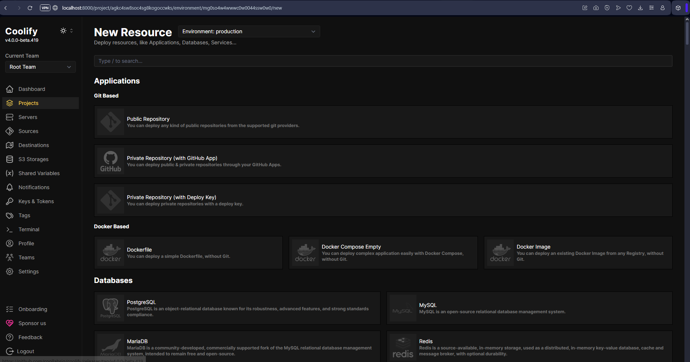

# Cara Install Coolify di WSL2 (Ubuntu) di Windows



Coolify adalah platform self-hosted untuk DevOps deployment. Kamu bisa install ini di WSL2 (Windows Subsystem for Linux) tanpa harus pakai server VPS.

## Prasyarat

- Windows 10/11 dengan WSL2
- Ubuntu (disarankan Ubuntu 22.04 di WSL)
- Sudah install WSL: [Petunjuk Resmi WSL](https://learn.microsoft.com/en-us/windows/wsl/install)
- Sudah install [Docker Desktop for Windows](https://www.docker.com/products/docker-desktop/)

Pastikan Docker Desktop aktif dan WSL integration diaktifkan untuk distro Ubuntu kamu.

---

## Langkah-langkah Instalasi

### 1. Buka Ubuntu WSL terminal

```bash
wsl
```

### 2. Jalankan perintah berikut untuk install Coolify

```bash
curl -fsSL https://cdn.coollabs.io/coolify/install.sh | bash
```

### 3. Tunggu proses berjalan

Instalasi akan:

- Install paket `curl`, `git`, `jq`, dll.
- Install dan konfigurasi OpenSSH Server
- Install Docker CE dan Plugin
- Setup file `.env`
- Download dan jalankan Coolify di Docker

Waktu instalasi sekitar 3–10 menit tergantung koneksi dan sistem.

---

## Akses Coolify dari Browser

Jika instalasi berhasil, akan muncul:

```bash
Your instance is ready to use!
You can access Coolify through:
http://localhost:8000
```

Buka browser di Windows, lalu akses:

```
http://localhost:8000
```

Jika tidak muncul, pastikan container-nya running:

```bash
sudo docker ps
```

---

## Catatan Tambahan

- Default port: `8000`
- File `.env` tersimpan di: `/data/coolify/source/.env`
- Backup `.env` jika ingin pindah ke server lain
- Untuk akses publik, kamu bisa mapping `localhost` ke domain atau pakai tunnel seperti [Ngrok](https://ngrok.com)

---

## Troubleshooting

| Masalah                           | Solusi                                                                                      |
| --------------------------------- | ------------------------------------------------------------------------------------------- |
| Docker tidak jalan                | Pastikan Docker Desktop aktif & WSL integration diaktifkan                                  |
| Tidak bisa akses `localhost:8000` | Pastikan container jalan (`sudo docker ps`) dan port 8000 tidak diblok firewall             |
| Permission denied Docker          | Jalankan dengan `sudo`, atau tambahkan user ke grup docker: `sudo usermod -aG docker $USER` |

---

## Selesai

Sekarang kamu bisa deploy aplikasi secara otomatis pakai Coolify langsung dari WSL.

