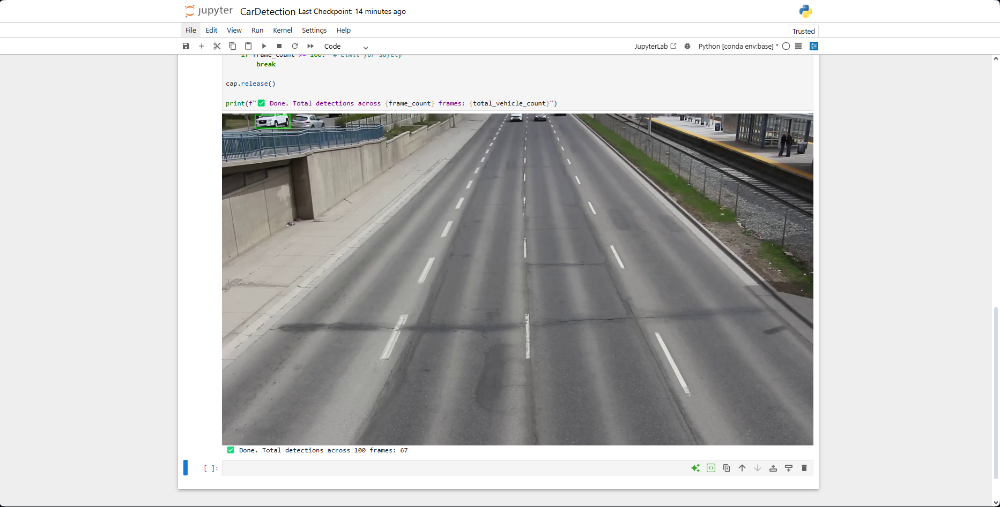

# 🚗 Vehicle Detection Counter with YOLOv8 (No Tracking)
 
This project demonstrates how to count vehicle detections (car, motorcycle, bus, truck) in a video using [YOLOv8](https://github.com/ultralytics/ultralytics) without tracking. It's optimized to run safely in **Jupyter Notebook** on Windows or CPU-based environments (e.g., with AMD RX 6600).

---

## 📦 Requirements

Install all dependencies using pip:

```bash
pip install ultralytics opencv-python pillow
````

---

## 📂 Project Structure

```
.
├── sample_video.mp4        # Your input video file
├── yolov8n.pt              # YOLOv8 Nano model (downloaded automatically if missing)
└── vehicle_count.ipynb     # Jupyter Notebook file with the detection script
```

---

## 🧠 Classes Detected

This script uses COCO class IDs for:

* 🚘 Car (`id: 2`)
* 🏍 Motorcycle (`id: 3`)
* 🚌 Bus (`id: 5`)
* 🚚 Truck (`id: 7`)

---

## ✅ How It Works

The script:

1. Loads YOLOv8 model (`yolov8n.pt`) on CPU
2. Opens a video file (`sample_video.mp4`)
3. Detects vehicles **per frame** (no tracking)
4. Adds bounding boxes for visualization
5. Displays preview in the notebook
6. Accumulates vehicle counts across frames

---

## ⚠️ Limitation

> This method **may overcount** the same vehicle across multiple frames
> since there’s **no object tracking**.

---

## 🖥 Sample Output

```
✅ Done. Total detections across 100 frames: 526
```

---

## 📌 Notes

* Safe for **Windows + AMD GPU (e.g. RX 6600)** users
* Will not crash Jupyter (no multiprocessing or threading)
* Supports frame limit for memory safety

---

## 🚀 Next Steps (Optional Ideas)

* Add tracking (`model.track()`) if your system supports it
* Save output video with bounding boxes
* Count unique vehicles by analyzing object size/location similarity
* Export per-frame stats to CSV

---

## 🔗 Credits

* [Ultralytics YOLOv8](https://github.com/ultralytics/ultralytics)
* [OpenCV](https://opencv.org/)
* [Pillow](https://pillow.readthedocs.io/en/stable/)

---

MIT License

```