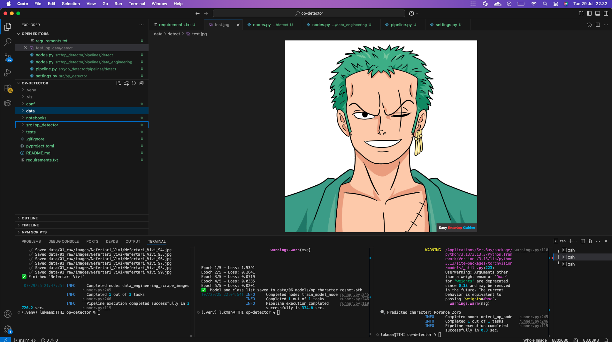

# OP-Detector
 
A Kedro-based computer vision pipeline to detect One Piece anime characters using a custom dataset scraped from DuckDuckGo.

## Project Structure

```
op-detector/
├── conf/
│   ├── base/
│   │   ├── catalog.yml
│   │   ├── parameters.yml
│   │   ├── parameters_data_engineering.yml
│   │   ├── parameters_train.yml
│   │   └── parameters_detect.yml
│   └── local/
├── data/
│   ├── 01_raw/
│   │   └── images/                 # Raw images scraped by data_engineering
│   ├── 06_models/
│   │   └── op_character_resnet.pth # Trained model checkpoint
│   └── detect/
│       └── test.jpg               # Sample image for inference
├── src/op_detector/
│   ├── pipelines/
│   │   ├── data_engineering/
│   │   │   ├── nodes.py
│   │   │   └── pipeline.py
│   │   ├── train/
│   │   │   ├── nodes.py
│   │   │   └── pipeline.py
│   │   └── detect/
│   │       ├── nodes.py
│   │       └── pipeline.py
│   └── settings.py
├── requirements.txt
└── README.md
```

## Setup

1. **Clone the repo** and navigate in:

   ```bash
   git clone https://github.com/lukman-ss/lab.git
   cd 10-op-detector/op-detector
   ```

2. **Create and activate a virtual environment**:

   ```bash
   python3 -m venv .venv
   source .venv/bin/activate
   ```

3. **Install dependencies**:

   ```bash
   pip install -r requirements.txt
   ```

4. **Ensure SSL certificates** (macOS only):

   ```bash
   pip install certifi
   ```

## Pipelines

### 1. Data Engineering (Scrape Images)

Pull images for each One Piece character using DuckDuckGo.

```bash
kedro run --pipeline=data_engineering
```

* Configured via `conf/base/parameters_data_engineering.yml`:

  ```yaml
  characters:
    - Monkey D. Luffy
    - Roronoa Zoro
    # ...
  max_results: 200
  raw_images_dir: "data/01_raw/images"
  ```

### 2. Train (Model Training)

Train a ResNet18 classifier on the scraped images.

```bash
kedro run --pipeline=train
```

* Configured via `conf/base/parameters_train.yml`:

  ```yaml
  train:
    raw_images_dir: "data/01_raw/images"
    model_output:   "data/06_models/op_character_resnet.pth"
    epochs:         5
  ```

### 3. Detect (Inference)

Run inference on a single image to predict the character.

```bash
kedro run --pipeline=detect --params="detect.image_path=data/detect/test.jpg"
```

* Configured via `conf/base/parameters_detect.yml`:

  ```yaml
  detect:
    image_path: "data/detect/test.jpg"
  ```

## Adding New Characters

1. Update `characters` list in `conf/base/parameters_data_engineering.yml`.
2. Re-run the data engineering pipeline:

   ```bash
   kedro run --pipeline=data_engineering
   ```
3. Re-run training to include new classes:

   ```bash
   kedro run --pipeline=train
   ```

## Notes

* **Partial prototype**: You can train and test on whatever subset of data you have—empty folders are skipped automatically.
* **Lazy imports**: DuckDuckGo scraping is only imported when running the scrape pipeline, so inference runs in isolation.

---

Happy detecting! 🚀
