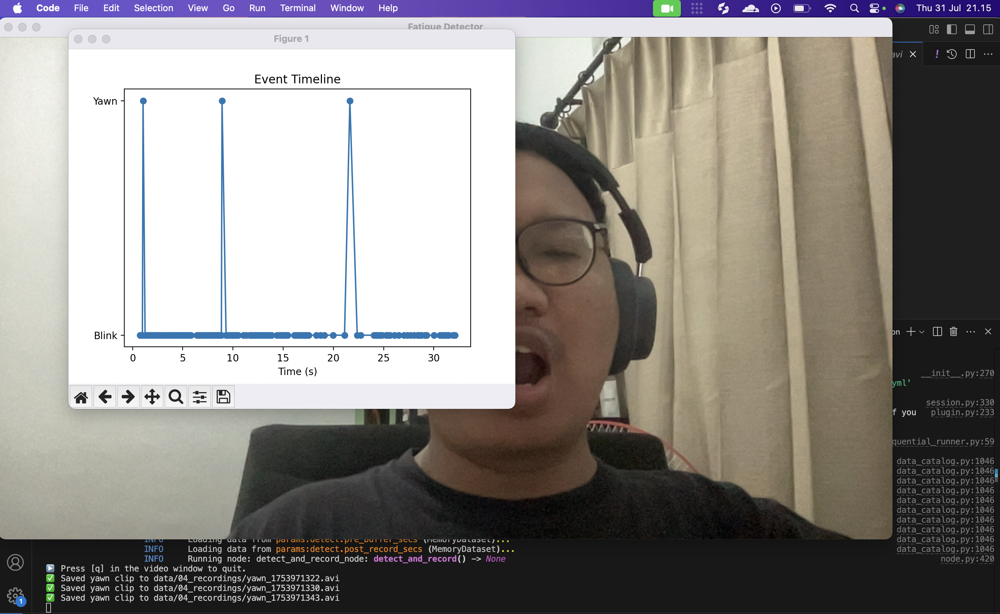

# Anti-Fatigue Detector
 
A Kedro-based computer-vision pipeline to detect signs of fatigue (yawns & “kucek mata” eye‐rubs) by:

1. **Scraping** example images from DuckDuckGo  
2. **Training** a ResNet18 classifier on those events  
3. **Detecting** live from your webcam & recording yawn clips

---

## 📁 Project Structure

```bash
anti-fatigue/
├── conf/
│   ├── base/
│   │   ├── catalog.yml
│   │   ├── parameters.yml               # global defaults (if any)
│   │   ├── parameters_scraping.yml      # events & scraping settings
│   │   ├── parameters_train.yml         # training settings
│   │   └── parameters_detect.yml        # live detection & recording settings
│   └── local/                           # override for local dev
├── data/
│   ├── 01_raw/
│   │   └── images/                      # scraped images
│   │       └── yawn/
│   ├── 06_models/
│   │   └── fatigue_model.pth           # trained checkpoint
│   └── 04_recordings/                  # auto-recorded yawn clips
│       └── yawn_<timestamp>.avi
├── src/
│   └── anti_fatigue_detector/
│       ├── pipelines/
│       │   ├── scraping/
│       │   │   ├── nodes.py            # scrape_images()
│       │   │   └── pipeline.py
│       │   ├── train/
│       │   │   ├── nodes.py            # train_model()
│       │   │   └── pipeline.py
│       │   └── detect/
│       │       ├── nodes.py            # detect_and_record()
│       │       └── pipeline.py
│       └── settings.py                 # register_pipelines()
├── requirements.txt                    # minimal, unpinned deps
└── README.md                           # project overview & usage
```


---

## ⚙️ Installation

```bash
git clone https://github.com/your-org/anti-fatigue-detector.git
cd anti-fatigue-detector
python3 -m venv .venv
source .venv/bin/activate
pip install -r requirements.txt
pip install duckduckgo-search pillow requests torch torchvision opencv-contrib-python matplotlib
````

---

## 🛠️ Configuration

### 1. Scraping parameters

**`conf/base/parameters_scraping.yml`**

```yaml
scraping:
  events:
    - yawn
    - "kucek mata"
  max_results:     200
  raw_images_dir:  "data/01_raw/images"
  lookup_timeout:  15
  download_timeout: 5
  polite_pause:     0.5
```

### 2. Training parameters

**`conf/base/parameters_train.yml`**

```yaml
train:
  raw_images_dir: "data/01_raw/images"
  model_output:   "data/06_models/fatigue_model.pth"
  epochs:         10
  batch_size:     32
  learning_rate:  0.0001
```

### 3. Detection parameters

**`conf/base/parameters_detect.yml`**

```yaml
detect:
  video_source:        0
  eye_closed_frames:   3
  yawn_frames:         3
  scale_factor_eye:    1.1
  min_neighbors_eye:   5
  scale_factor_smile:  1.7
  min_neighbors_smile: 20
  record_dir:          "data/04_recordings"
  pre_buffer_secs:     2
  post_record_secs:    3
```

---

## 🚀 Usage

### 1. Scrape example images

```bash
kedro run --pipeline=scraping
```

Folders created under `data/01_raw/images/`:

* `yawn/`
* `kucek_mata/`

### 2. Train your model

```bash
kedro run --pipeline=train
```

Saves your fine-tuned ResNet18 to `data/06_models/fatigue_model.pth`.

### 3. Live detection & recording

```bash
kedro run --pipeline=detect
```

* Webcam feed with “Blink” or “Yawn” overlaid
* Live event timeline plot
* Automatically records yawn clips to `data/04_recordings/*.avi`

Press **`q`** in the video window to quit.

---

## 💡 Notes

* Scraping uses the official **duckduckgo-search** library via a lazy import—no broken pipelines if you skip scraping.
* Detection uses OpenCV’s Haar cascades; works on Python 3.13 without additional codecs.
* Recorded `.avi` clips play in VLC; convert to MP4 for QuickTime compatibility.
