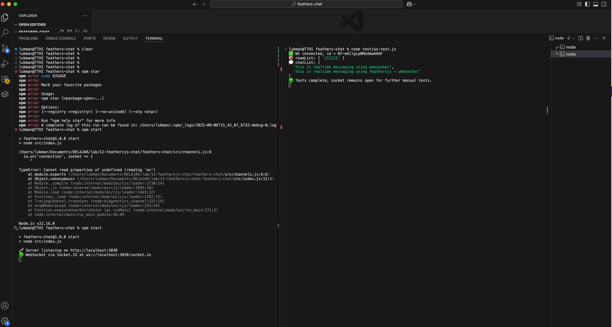

# FeathersJS Chat



A lightweight, in-memory chat API built with FeathersJS, Express, and Socket.IO.  
Provides REST endpoints for room management and real-time messaging over WebSocket.

## Features

- Create and manage chat rooms via HTTP  
- Send and broadcast messages via HTTP or WebSocket  
- List all rooms and fetch chat history over Socket.IO  
- All data stored in memory (no external database)

## Prerequisites

- **Node.js** version **22**  
- **npm** (or Yarn)

## Installation

```bash
git clone https://github.com/lukman-ss/lab.git
cd 12-feathersjs-chat/feathers-chat
npm install
````

## Configuration

No additional configuration is required. The service listens on port **3030** by default.

```bash
npm start
```

## Usage

### HTTP Endpoints

#### Create a Room

`POST /room`

```json
{ "room_id": "room1" }
```

* **201 Created**

  ```json
  { "status": "room created", "room_id": "room1" }
  ```
* **400 Bad Request** if `room_id` is missing
* **409 Conflict** if the room already exists

#### Send a Message

`POST /send`

```json
{ "room_id": "room1", "message": "Hello world" }
```

* **200 OK**

  ```json
  { "status": "sent" }
  ```
* **400 Bad Request** if parameters are missing
* **404 Not Found** if the room does not exist

### WebSocket (Socket.IO)

Connect to `ws://localhost:3030` (default path `/socket.io`).

* **joinRoom**

  ```js
  socket.emit('joinRoom', { room_id: 'room1' })
  ```

  ↳ **joinedRoom**

  ```js
  socket.on('joinedRoom', ({ room_id }) => {})
  ```

* **listRoom**

  ```js
  socket.emit('listRoom')
  ```

  ↳ **roomList**

  ```js
  socket.on('roomList', rooms => {})
  ```

* **listChat**

  ```js
  socket.emit('listChat', { room_id: 'room1' })
  ```

  ↳ **chatList**

  ```js
  socket.on('chatList', history => {})
  ```

* **sendMessage**

  ```js
  socket.emit('sendMessage', { room_id: 'room1', message: 'Hi!' })
  ```

  ↳ **newMessage** broadcast to all in room

  ```js
  socket.on('newMessage', ({ room_id, message }) => {})
  ```

## Development

* All code is in plain JavaScript under `src/`.
* To add persistence, replace the in-memory maps with a database in `src/app.js` and `src/channels.js`.
* You can layer on authentication, validation, or integrate a frontend client.

## Contributing

1. Fork the repository
2. Create a feature branch
3. Write tests and update documentation
4. Open a pull request
