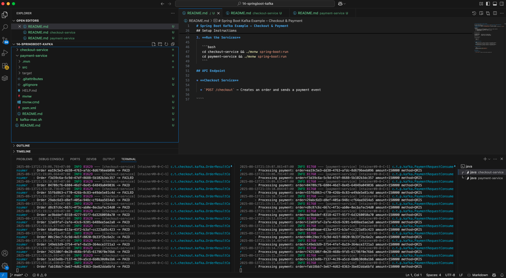

# Spring Boot Kafka Example – Checkout & Payment

This project demonstrates an **Event-Driven Architecture** using **Spring Boot** and **Apache Kafka**.  
It consists of two microservices:
- **Checkout Service** – Sends a `PaymentRequestedEvent` when an order is created.
- **Payment Service** – Listens for `PaymentRequestedEvent`, processes the payment, and sends back a `PaymentResultEvent`.

## Architecture
```mermaid
flowchart LR
    A[Checkout Service] -- PaymentRequestedEvent --> B[Kafka Topic: payments.requested]
    B -- PaymentRequestedEvent --> C[Payment Service]
    C -- PaymentResultEvent --> D[Kafka Topic: payments.completed]
    D -- PaymentResultEvent --> A
````

## Project Structure

```
14-springboot-kafka
├─ checkout-service/     # Microservice for creating orders
├─ payment-service/      # Microservice for processing payments
├─ kafka-mac.sh          # Helper script to start Kafka on Mac
```

## Setup Instructions

1. **Start Kafka**

   ```bash
   ./kafka-mac.sh
   ```

2. **Create Kafka Topics**

   ```bash
   $KHOME/bin/kafka-topics.sh --create --if-not-exists --topic payments.requested \
       --bootstrap-server localhost:9092 --partitions 3 --replication-factor 1

   $KHOME/bin/kafka-topics.sh --create --if-not-exists --topic payments.completed \
       --bootstrap-server localhost:9092 --partitions 3 --replication-factor 1
   ```

3. **Run the Services**

   ```bash
   cd checkout-service && ./mvnw spring-boot:run
   cd payment-service && ./mvnw spring-boot:run
   ```

## API Endpoint

```markdown
* **Checkout Service**

  * `POST /api/checkout` – Creates an order and sends a payment event  
  * `GET /api/orders/{orderId}` – Retrieves an order by ID  
```

